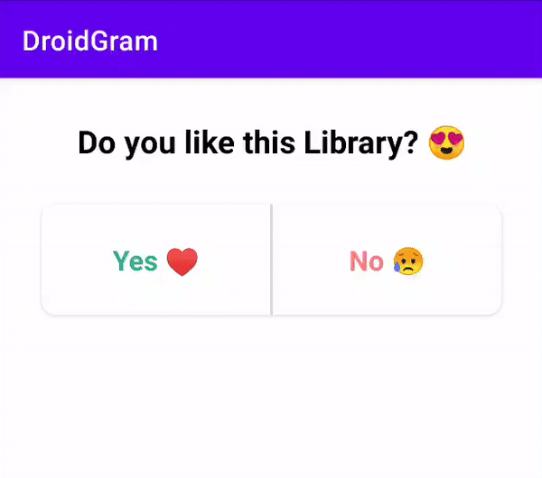

# DroidGram- An Android UI Library Inspired by Instagram.
[](https://www.android.com)
[](https://android-arsenal.com/api?level=21)
[](https://www.apache.org/licenses/LICENSE-2.0.html)

## What can it do 🤔

This library is made for learning purposes of replicating Instagram's UI Widgets in 2020 in Android (100% Kotlin)

<p align="center">
 <center></a></center>
</p>


## Prerequisites

Add this in your root `build.gradle` file (**not** your module `build.gradle` file):
```gradle
allprojects {
	repositories {
		...
		maven { url "https://jitpack.io" }
	}
}
```

## Dependency

Add this to your module's `build.gradle` file (make sure the version matches the JitPack badge above):

```gradle
dependencies {
	...
	implementation 'com.github.codewithbg:DroidGram:1.0.0'
}
```

## How Was It Made Video
[Click here to see behind the scenes on Youtube](https://bit.ly/droidgram-demo)

## Usage
In this library all the UI widgets try to mock Instagram's widgets like Poll Widget, it's textview where the colors are tinted with gradients.

### Instagram Like Poll Sticker Android

#### Layout(XML)
```xml
    <com.androar.droidgram.PollView
        android:id="@+id/poll_widget"
        android:layout_width="match_parent"
        android:layout_height="wrap_content"
        app:questionText="Do you like Curd?"
        app:optionOneText="Yes 😁"
        app:optionTwoText="No 🤢"
        app:pollCardHeight="80dp"    <!---- Optional --->
        app:pollOptionsHeight="40dp"  <!---- Optional --->
        app:pollOptionsCornerRadius="15dp"  <!---- Optional --->
        app:pollBackgroundColor="@android:color/white"  <!---- Optional --->
        app:optionOneBackgroundColor="@android:color/white"  <!---- Optional --->
        app:optionTwoBackgroundColor="@android:color/white"  <!---- Optional --->
        app:questionTextColor="@android:color/black"  <!---- Optional --->
        app:questionTextSize="23dp"  <!---- Optional --->
        app:optionOneStartColor="@android:color/blue"  <!---- Optional --->
        app:optionTwoStartColor="@android:color/blue"  <!---- Optional --->
        app:optionOneEndColor="@android:color/green"  <!---- Optional --->
        app:optionTwoEndColor="@android:color/green"  <!---- Optional --->
        app:optionOneTextSize="18dp"  <!---- Optional --->
        app:optionTwoTextSize="18dp"  <!---- Optional --->
        app:pollDividerColor="@android:color/grey"  <!---- Optional --->
        app:optionOnePercentage="23F"  <!---- Optional, Ideally set it on runtime using code --->
        app:optionTwoPercentage="77F"  <!---- Optional, Ideally set it on runtime using code --->
        app:defaultOptionOneFromValue="50F"  <!---- Optional --->
        app:defaultOptionTwoFromValue="50F"  <!---- Optional --->
        app:pollAnimationDuration="500"  <!---- Optional --->
        app:minThresholdValue="10F"  <!---- Optional --->
        app:maxThresholdValue="90F"  <!---- Optional --->
        />

```
#### Activity Or Fragment

You can set these properties in your java or kotlin code as well.
Anything that's set in XML, can be set on Runtime using PollView.SetFunction()
If you want to apply any custom UI changes, use the public getters and apply your styles to them, that's the reason getters aren't public in the library.
**It's important to call poll_view.attachCallBackListener(this) on your fragments/activites and implement callbacks. See Sample for reference.**

```kotlin

class MainActivity : AppCompatActivity(), PollView.CardPollWidgetCallBack {

    override fun onCreate(savedInstanceState: Bundle?) {
        super.onCreate(savedInstanceState)
        setContentView(R.layout.activity_main)
        findViewById<PollView>(R.id.poll_widget).apply {
            setPollQuestion("Do you like this Library? 😍")
            setPollAnswers("Yes ♥", "No 😥")
            attachCallBackListener(this@MainActivity)
        }
    }

    override fun onOptionOneSelected(pollAnswer: String?) {
        findViewById<PollView>(R.id.poll_widget).apply {
            reset()
            setOptionOnePercentage(90F)
        }
    }

    override fun onOptionTwoSelected(pollAnswer: String?) {
        findViewById<PollView>(R.id.poll_widget).apply {
            reset()
            setOptionTwoPercentage(70F)
        }
    }

```

### Instagram-like Gradient TextView

#### Layout(XML)
```xml
    <com.androar.droidgram.GradientTextView
        android:layout_width="wrap_content"
        android:layout_height="wrap_content"
        app:gradientStartColor="@color/default_gradient_text_view_color_two"
        app:gradientEndColor="@color/default_gradient_text_view_color_three"
        android:text="You like ice-cream though, don't you?"
        android:textSize="26sp"
        android:gravity="center"
        android:layout_gravity="center"/>
```

#### Activity Or Fragment
**You can set these properties in your java or kotlin code as well.**

### Instagram like Multiple Choice Question Answer Widget
Coming soon, feel free to Contribute on this as well!

### Instagram like  Choice Question Answer
Coming soon, feel free to Contribute on this as well!


## If this project helps you in anyway, show your love :heart: by putting a :star: on this project :v:

## Contributing

Please fork this repository and contribute back using
[pull requests](https://github.com/codewithbg/DroidGram/pulls).

Any contributions, large or small, major features, bug fixes, are welcomed and appreciated
but will be thoroughly reviewed .

### Contact - Let's become friends
- [Mailing List - 1 email per month. No Spam.](https://bit.ly/code-with-bg/)
- [CodeWithBG Youtube](https://bit.ly/code-with-bg-youtube)
- [About Me](https://goforbg.com/)
- [Linkedin](https://www.linkedin.com/in/goforbg/)


## License

* [Apache Version 2.0](http://www.apache.org/licenses/LICENSE-2.0.html)

```
Copyright 2020 Bharadwaj Giridhar

Licensed under the Apache License, Version 2.0 (the "License");
you may not use this file except in compliance with the License.
You may obtain a copy of the License at

 http://www.apache.org/licenses/LICENSE-2.0

Unless required by applicable law or agreed to in writing, software
distributed under the License is distributed on an "AS IS" BASIS,
WITHOUT WARRANTIES OR CONDITIONS OF ANY KIND, either express or implied.
See the License for the specific language governing permissions and
limitations under the License.